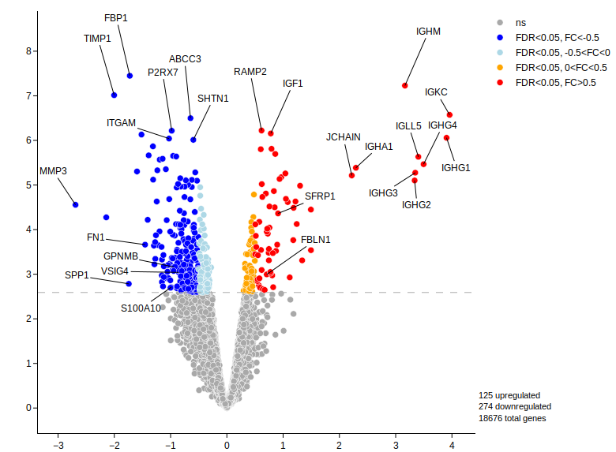

<!DOCTYPE html>
<html>
<body>

<h1>The HTML template</h1>

This example fills the web page with one new div .......... some text 

<template>
  I like this code:
</template>

<pre>
  <code>
    p { color: red; }
    body { background-color: #eee; }
  </code>
</pre>

 <a href="#Specify_a_Hyperlink_Target_href">This first anchor element</a> links back to the heading of this section of the tutorial by linking to an <code>id</code> we assigned to the section heading element. We can use the <code>mailto</code> protocol to create a link that will try to launch the default email program on your computer. Let's give it a try! We'd love for you to <a href="mailto:contact@html.com"> get in touch</a> with us! Lastly, if you click the link below a complimentary JavaScript alert window will appear. <a> Click the link to see what happens</a>.

Read more: https://html.com/anchors-links/#ixzz77HcBAYOD
 
  <li><a href="#quick-start">Quick start</a></li>
  <li><a href="#input-data">Input data</a></li>
  <li><a href="#examples-volcano">Examples Volcanoplot</a></li>
  <li><a href="#publications">Publications</a></li>
  <ul><a href="#citation">How to cite</a></ul>
  
  <a href="#Specify_a_Hyperlink_Target_href1">This first anchor element</a> links back to the heading of this section of the tutorial by linking to an <code>id</code> we assigned to the section heading element. We can use the <code>mailto</code> protocol to create a link that will try to launch the default email program on your computer. Let's give it a try! We'd love for you to <a href="mailto:contact@html.com"> get in touch</a> with us! Lastly, if you click the link below a complimentary JavaScript alert window will appear. <a> Click the link to see what happens</a>.

Read more: https://html.com/anchors-links/#ixzz77HcBAYOD
  
   
Lorem ipsum dolor sit amet, consectetuer adipiscing elit. Aenean commodo ligula eget dolor. Aenean massa. Cum sociis natoque penatibus et magnis dis parturient montes, nascetur ridiculus mus. Donec quam felis, ultricies nec, pellentesque eu, pretium quis, sem. Nulla consequat massa quis enim. Donec pede justo, fringilla vel, aliquet nec, vulputate eget, arcu. In enim justo, rhoncus ut, imperdiet a, venenatis vitae, justo. Nullam dictum felis eu pede mollis pretium. Integer tincidunt. Cras dapibus. Vivamus elementum semper nisi. Aenean vulputate eleifend tellus. Aenean leo ligula, porttitor eu, consequat vitae, eleifend ac, enim. Aliquam lorem ante, dapibus in, viverra quis, feugiat a, tellus. Phasellus viverra nulla ut metus varius laoreet. Quisque rutrum. Aenean imperdiet. Etiam ultricies nisi vel augue. Curabitur ullamcorper ultricies nisi. Nam eget dui. Etiam rhoncus. Maecenas tempus, tellus eget condimentum rhoncus, sem quam semper libero, sit amet adipiscing sem neque sed ipsum. Nam quam nunc, blandit vel, luctus pulvinar, hendrerit id, lorem. Maecenas nec odio et ante tincidunt tempus. Donec vitae sapien ut libero venenatis faucibus. Nullam quis ante. Etiam sit amet orci eget eros faucibus tincidunt. Duis leo. Sed fringilla mauris sit amet nibh. Donec sodales sagittis magna. Sed consequat, leo eget bibendum sodales, augue velit cursus nunc, quis gravida magna mi a libero. Fusce vulputate eleifend sapien. Vestibulum purus quam, scelerisque ut, mollis sed, nonummy id, metus. Nullam accumsan lorem in dui. Cras ultricies mi eu turpis hendrerit fringilla. Vestibulum ante ipsum primis in faucibus orci luctus et ultrices posuere cubilia Curae; In ac dui quis mi consectetuer lacinia. Nam pretium turpis et arcu. Duis arcu tortor, suscipit eget, imperdiet nec, imperdiet iaculis, ipsum. Sed aliquam ultrices mauris. Integer ante arcu, accumsan a, consectetuer eget, posuere ut, mauris. Praesent adipiscing. Phasellus ullamcorper ipsum rutrum nunc. Nunc nonummy metus. Vestibulum volutpat pretium libero. Cras id dui. Aenean ut eros et nisl sagittis vestibulum. Nullam nulla eros, ultricies sit amet, nonummy id, imperdiet feugiat, pede. Sed lectus. Donec mollis hendrerit risus. Phasellus nec sem in justo pellentesque facilisis. Etiam imperdiet imperdiet orci. Nunc nec neque. Phasellus leo dolor, tempus non, auctor et, hendrerit quis, nisi. Curabitur ligula sapien, tincidunt non, euismod vitae, posuere imperdiet, leo. Maecenas malesuada. Praesent congue erat at massa. Sed cursus turpis vitae tortor. Donec posuere vulputate arcu. Phasellus accumsan cursus velit. Vestibulum ante ipsum primis in faucibus orci luctus et ultrices posuere cubilia Curae; Sed aliquam, nisi quis porttitor congue, elit erat euismod orci, ac placerat dolor lectus quis orci. Phasellus consectetuer vestibulum elit. Aenean tellus metus, bibendum sed, posuere ac, mattis non, nunc. Vestibulum fringilla pede sit amet augue. In turpis. Pellentesque posuere. Praesent turpis. Aenean posuere, tortor sed cursus feugiat, nunc augue blandit nunc, eu sollicitudin urna dolor sagittis lacus. Donec elit libero, sodales nec, volutpat a, suscipit non, turpis. Nullam sagittis. Suspendisse pulvinar, augue ac venenatis condimentum, sem libero volutpat nibh, nec pellentesque velit pede quis nunc. Vestibulum ante ipsum primis in faucibus orci luctus et ultrices posuere cubilia Curae; Fusce id purus. Ut varius tincidunt libero. Phasellus dolor. Maecenas vestibulum mollis"

 
  
Other Bioconductor packages with similar aims are <a href="http://bioconductor.org/packages/edgeR">edgeR</a>, <a href="http://bioconductor.org/packages/limma">limma</a>, <a href="http://bioconductor.org/packages/DSS">DSS</a>, <a href="http://bioconductor.org/packages/EBSeq">EBSeq</a>, and <a href="http://bioconductor.org/packages/baySeq">baySeq</a>.

  

<h2>Quick start</h2>

Here we show the most basic steps for a differential expression analysis. There are a variety of steps upstream of DESeq2 that result in the generation of counts or estimated counts for each sample, which we will discuss in the sections below. This code chunk assumes that you have a count matrix called <code>cts</code> and a table of sample information called <code>coldata</code>. The <code>design</code> indicates how to model the samples, here, that we want to measure the effect of the condition, controlling for batch differences. The two factor variables <code>batch</code> and <code>condition</code> should be columns of <code>coldata</code>.

  

<h2>Input data </h2>

ibendum sed, posuere ac, mattis non, nunc. Vestibulum fringilla pede sit amet augue. In turpis. Pellentesque posuere. Praesent turpis

 

<h2>Examples: how to use volcanoplot function</h2>

  Phasellus accumsan cursus velit. Vestibulum ante ipsum primis in faucibus orci luctus et ultrices.................................... ibendum sed, posuere ac, mattis non, nunc. Vestibulum fringilla pede sit amet augue. In turpis.

<pre>
  <code>
devtools::install_github("myles-lewis/easylabel", auth_token="...")
library(easylabel)
  </code>
</pre>
   

<u>Plots:</u>

   

  
<h2>Publications</h2>

 Articles are gven in the table below

  
  <table>
  <tr>
    <th>Company</th>
    <th>Contact</th>
    <th>Country</th>
  </tr>
  <tr>
    <td>Alfreds Futterkiste</td>
    <td>Maria Anders</td>
    <td>Germany</td>
  </tr>
  <tr>
    <td>Centro comercial Moctezuma</td>
    <td>Francisco Chang</td>
    <td>Mexico</td>
  </tr>
  <tr>
    <td>Ernst Handel</td>
    <td>Roland Mendel</td>
    <td>Austria</td>
  </tr>
  <tr>
    <td>Island Trading</td>
    <td>Helen Bennett</td>
    <td>UK</td>
  </tr>
  <tr>
    <td>Laughing Bacchus Winecellars</td>
    <td>Yoshi Tannamuri</td>
    <td>Canada</td>
  </tr>
  <tr>
    <td>Magazzini Alimentari Riuniti</td>
    <td>Giovanni Rovelli</td>
    <td>Italy</td>
  </tr>
</table>
  

<h2> Citation</h2>

If you use volcanoplot please cite .......................................

  
  
  
  
</body>
</html>

