# Introduction

A common problem in R is labelling scatter plots with large numbers of points
and/or labels. We provide a utility for easy labelling of scatter plots and 
quick plotting of volcano plots and MA plots for gene expression analyses. Using
an interactive shiny and plotly interface, users can hover over points to see
where specific points are located and click on points to easily label them. 
Labels can be toggled on/off simply by clicking. An input box and batch input 
window provides an easy way to label points by name. Labels can be dragged 
around the plot to place them optimally. Notably we provide an easy way to 
export directly to PDF for publication.

```{r setup, include = FALSE}
knitr::opts_chunk$set(
  collapse = TRUE
)
library(easylabel)
```

# Installation

Install from CRAN
```{r eval = FALSE}
install.packages("easylabel")
library(easylabel)
```

Install from Github
```{r eval = FALSE}
devtools::install_github("myles-lewis/easylabel")
library(easylabel)
```

If you wish to use the optional `useQ` argument with `easyVolcano()` and 
`easyMAplot()`, you will need to install additional package `qvalue` from 
Bioconductor:
```{r eval = FALSE}
if (!requireNamespace("BiocManager", quietly = TRUE))
  install.packages("BiocManager")
BiocManager::install("qvalue")
```

If you wish to use the optional `fullGeneNames` argument, you will need to 
install packages `AnnotationDbi` and `org.Hs.eg.db` from Bioconductor:
```{r eval = FALSE}
BiocManager::install("AnnotationDbi")
BiocManager::install("org.Hs.eg.db")
```

# Scatter plots

Use `easylabel()` to open a shiny app and plot and label scatter plots. A table of 
the main data is supplied in the Table tab for easy viewing of data.

```{r eval = FALSE}
data(mtcars)
easylabel(mtcars, x = 'mpg', y = 'wt',
          colScheme = 'royalblue')
```

```{r scatter1, echo = FALSE, message=FALSE, fig.align='center', out.width='80%', out.extra='style="border: 0;"'}
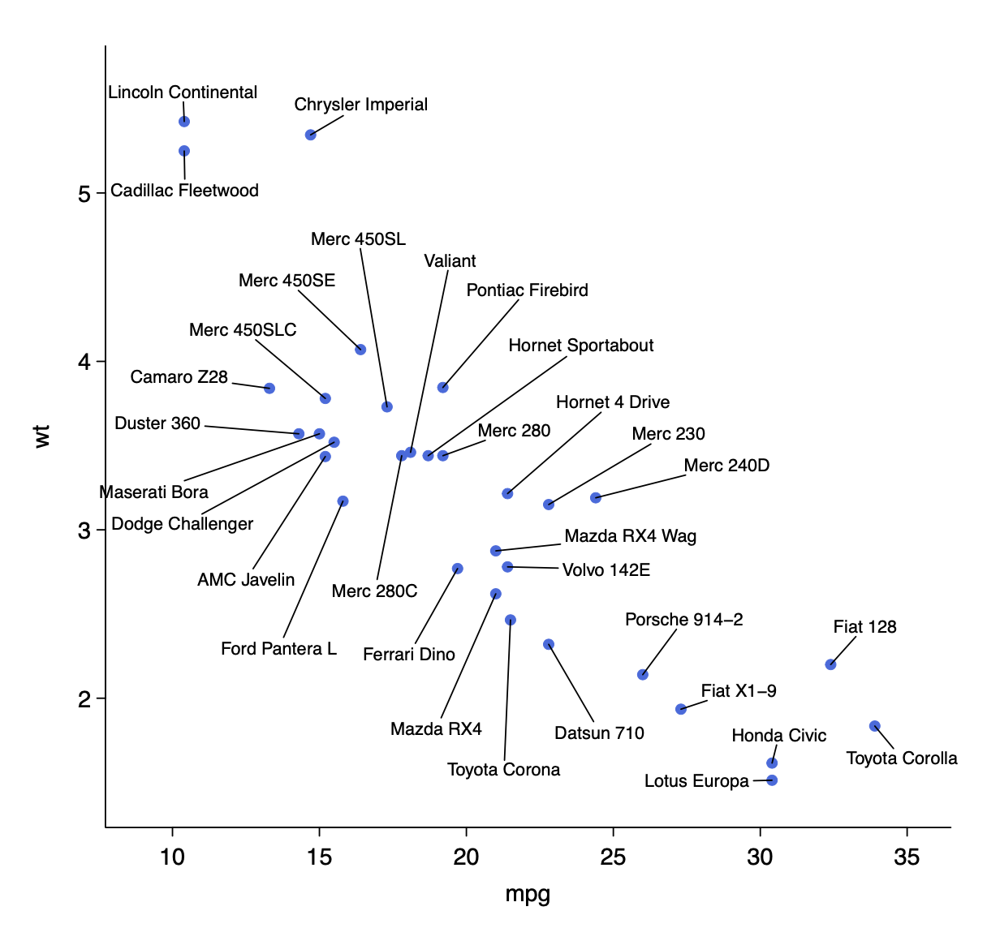
```

## Export plot to PDF
* Hover over and click on/off genes which you want to label.
* When you have selected all your chosen genes, then drag gene names to move
  label positions.
* Click the save button to export a PDF in base graphics.

## Export SVG from plotly
* Switch to SVG when finalised (only do this at last moment as otherwise
  editing can very slow, particularly with large numbers of points).
* Press the camera button in the plotly modebar to save image as SVG.

## Export as plotly 

The `output_shiny` option enables users to switch between using shiny and plotly 
outputs. For example to extract a plotly figure with interactive annotations: 

```{r, eval=FALSE}
data(mtcars)

p1 <- easylabel(mtcars, x = 'mpg', y = 'wt', col = 'cyl', 
          startLabels = rownames(mtcars)[mtcars$gear == 5], 
          output_shiny=FALSE) %>% 
  layout(yaxis=list(zeroline=FALSE))

p2 <- easylabel(mtcars, x = 'mpg', y = 'drat', col = 'vs', 
                colScheme=c("dodgerblue", "orange"), 
                startLabels = rownames(mtcars)[mtcars$gear == 5], 
                output_shiny=FALSE) %>% 
  layout(xaxis=list(zeroline=FALSE))


plotly::subplot(p1, p2, nrows=2, shareY = T, titleX = T, margin=0.05)
```

```{r plotlyOutput, echo = FALSE, message=FALSE, fig.align='center', out.width='80%', out.extra='style="border: 0;"'}
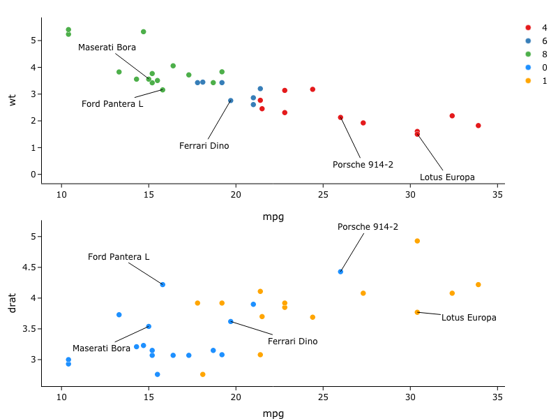
```

## Colour

Similar to ggplot2 and plotly, colour can either be set as a single colour, 
using `colScheme = 'blue'` or can be set to change with the level of a factor 
variable within `data` by setting `col`. Transparency can be altered by setting
`alpha`. Currently colour gradients are not supported.

```{r eval = FALSE}
easylabel(mtcars, x = 'mpg', y = 'wt',
          col = 'cyl')
```

## Shape

Marker shapes can either be set as a single shape using `shapeScheme = 21`, 
based on the base graphics `pch` symbol scheme (see `points()`), or shapes can 
be set to change with the level of a factor variable within `data` by setting 
`shape`. Shapes and colours can be combined.

```{r eval = FALSE}
# gapminder data set
if(!require(gapminder)) {install.packages("gapminder")}
library(gapminder)
easylabel(gapminder[gapminder$year == 2007, ], x = 'gdpPercap', y = 'lifeExp',
          col = 'continent', shape = 'continent',
          size = 10,
          labs = 'country', 
          zeroline = FALSE)
```

```{r scatter3, echo = FALSE, message=FALSE, fig.align='center', out.width='80%', out.extra='style="border: 0;"'}
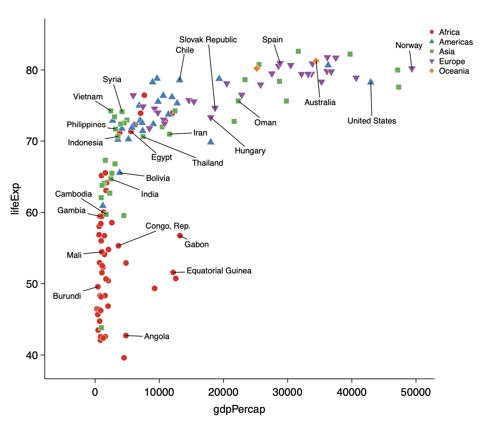
```

## Size

The size of all markers can be adjusted by setting `size` to a single number 
e.g. `size = 6` (default 8). Size can be assigned to a column of continuous data 
within `data` to produce a bubble chart. The size of points is automatically 
scaled to fit within a range of point sizes, determined by `scaleRange`.

```{r eval = FALSE}
library(gapminder)
easylabel(gapminder[gapminder$year == 2007, ], x = 'gdpPercap', y = 'lifeExp',
          col = 'continent', labs = 'country', 
          size = 'pop',
          alpha = 0.6,
          zeroline = FALSE)
```

```{r bubble, echo = FALSE, message=FALSE, fig.align='center', out.width='80%', out.extra='style="border: 0;"'}
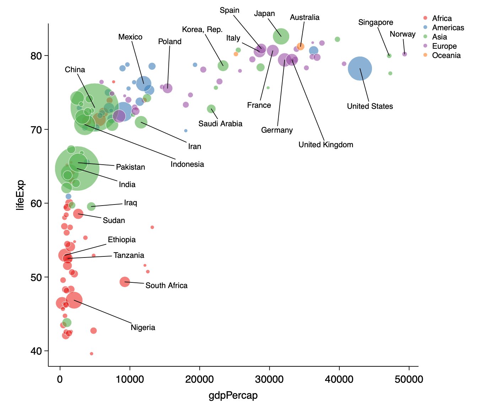
```

## Choosing label names

By default, `easylabel()` takes the rownames of the main dataframe as the label 
names. Any column can be selected for label names by setting `labs` to the name 
of a column within `data`, as for example in the Gapminder dataset plots above.

## Controlling axes

### Axis titles

Axis titles can be set using `xlab` and `ylab`. These accept R expressions to 
allow maths symbols. This is primarily designed to work when exporting plots to 
PDF via base graphics, since plotly does not natively understand expressions.

```{r eval = FALSE}
easylabel(xymatrix, x = 'x', y = 'y', col = 'col',
          colScheme = c('darkgrey', 'green3', 'gold3', 'blue'),
          xlab = expression("log"[2] ~ " fold change post-Rituximab"),
          ylab = expression("log"[2] ~ " fold change post-Tocilizumab"),
          showgrid = TRUE)
```

```{r plot1, echo = FALSE, message=FALSE, fig.align='center', out.width='80%', out.extra='style="border: 0;"'}
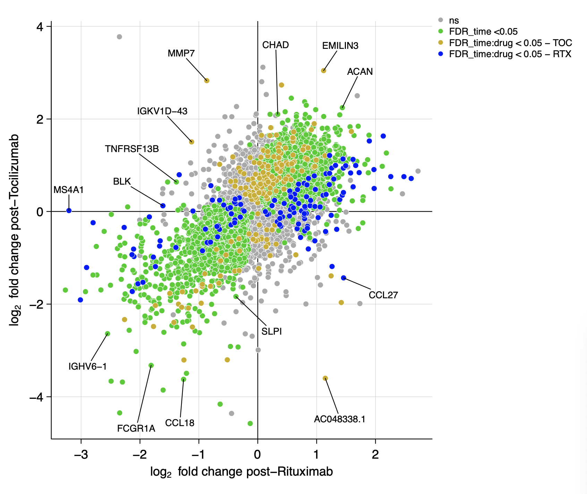
```

### Axis limits and outliers

`xlim` and `ylim` allow control over the range of each axis. Outlying points are
shown as diamonds. Outliers can be toggled off using 
`showOutliers = FALSE`. Outlier symbol, colour and line width can be set using 
`outlier_shape`, `outlier_col` and `outlier_lwd` respectively.

### Axis tick marks

Axis tick marks can be controlled by setting `xaxp` or `yaxp` to a vector of 
form `c(x1, x2, n)` where `x1` and `x2` are the limits of the tick marks and 
`n` is the number of intervals between tick marks.

For full customisation of axis tick coordinates and labels use `xticks` or
`yticks`, which are specified as a list of two named vectors `at = ...` and 
`labels = ...`.

```{r eval = FALSE}
# example axis ticks
if(!require(gapminder)) {install.packages("gapminder")}
library(gapminder)
easylabel(gapminder[gapminder$year == 2007, ], x = 'gdpPercap', y = 'lifeExp',
          col = 'continent', shape = 'continent',
          size = 10,
          labs = 'country', 
          zeroline = FALSE,
          xaxp = c(0, 50000, 10),
          yaxp = c(40, 85, 9),
          showgrid = TRUE)
```


## Gridlines

Gridlines can be shown by setting `showgrid = TRUE`. If `showgrid` is set to 
`"x"` or `"y"` then gridlines are shown only for that axis. Density of gridlines 
can be controlled by setting `xaxp` or `yaxp` (see [Axis tick marks]).

Black lines through the origin can be controlled by setting `zeroline` to 
`TRUE` or `FALSE`.

Dashed grey horizontal lines can be added at specific levels by setting `hline` 
with a vector of values. Similarly dashed grey vertical lines can be added by 
setting `vline` with a vector of values.

## Legends

Setting `showLegend` to `TRUE` or `FALSE` can be used to show or hide the 
legend.

Legends can be positioned by setting `legendxy`. This gives a vector of 
coordinates for the position of the legend in plotly paper reference with 
`c(0, 0)` being the bottom left corner and `c(1, 1)` being the top right corner 
of the plot window.

Plotly has unusual behaviour in that the x coordinate always aligns the left
side of the legend. However, the y coordinate aligns the top, middle or
bottom of the legend dependent on whether it is in the top, middle or bottom
1/3 of the plot window. So `c(1, 0)` positions the legend in the bottom right
corner outside the right margin of the plot, while `c(1, 0.5)` centre aligns
the legend around the centre of y axis.

## Further control of plotting

Further control of plotting can be achieved by passing other arguments to 
plot() via R's `...` argument. For example, a box around the plot can be added 
using `bty='o'` (see `par()`). Note this method only works for saving to PDF 
since it is not supported by plotly. 

## panel.last

Base graphics' `panel.last` argument is a flexible way to add plotting commands.
This provides a way to add trend lines, loess lines or any additional features 
such as extra legends to the plot after the points are plotted, but before 
labels are drawn. Note that `panel.last` only works when saving to PDF, and is 
not available in plotly.

```{r eval = FALSE}
# example adding a trend line using panel.last
fit <- lm(xymatrix$y ~ xymatrix$x)
easylabel(xymatrix, x = 'x', y = 'y', col = 'col',
          colScheme = c('darkgrey', 'green3', 'gold3', 'blue'),
          xlab = expression("log"[2] ~ " fold change post-Rituximab"),
          ylab = expression("log"[2] ~ " fold change post-Tocilizumab"),
          showgrid = TRUE, fullGeneNames = TRUE,
          panel.last = {
            abline(fit, col='red')
          })
```

## plotly_filter

This argument is used to reduce the number of scatter points displayed by 
plotly, to prevent plotly becoming sluggish or unusable, which happens above 
about 200,000 points. To plot large datasets such as genomic data, we recommend 
adding a logical column to your dataset which filters out points of interest 
for inspecting and labelling via plotly. `plotly_filter` specifies the name of 
this column. Saving to PDF retains the full dataset and all points will be 
plotted. This argument is used by the `easyManhattan()` function (see 
[Manhattan plot]).


# Volcano plots

Use the `easyVolcano()` function to quickly plot a volcano plot from DESeq2 or
EdgeR objects. The `useQ` argument will switch to using q values for FDR.

```{r}
# Example DESeq2 object
head(volc1)

# Example limma object
head(volc2)
```

```{r eval = FALSE}
# Typical DESeq2 workflow
volc1 <- results(dds)
easyVolcano(volc1, useQ = TRUE)
```

If you want to specify your own columns within the dataset set `x` to the column 
containing log fold change, `y` to the column containing raw p values and `padj` 
to the column containing adjusted p values.
`labs` can be used to specify the column containing label names, otherwise this 
defaults to `rownames(data)`.

```{r eval = FALSE}
# Manually specify columns
easyVolcano(volc1, x = 'log2FoldChange', y = 'pvalue', padj = 'padj')

# To use nominal unadjusted p value for significant genes
easyVolcano(volc1, x = 'log2FoldChange', y = 'pvalue')
```

Note that if you specify `y` for a column of p values but leave `padj` blank, 
the function assumes you are using nominal unadjusted p values for the cutoff 
for significance.

## MA plots

Use the `easyMAplot()` function to quickly plot an MA plot from DESeq2 or EdgeR
objects.

```{r eval = FALSE}
easyMAplot(volc2, useQ = TRUE)
```

```{r easyMAplot1, echo = FALSE, message=FALSE, fig.align='center', out.width='80%', out.extra='style="border: 0;"'}
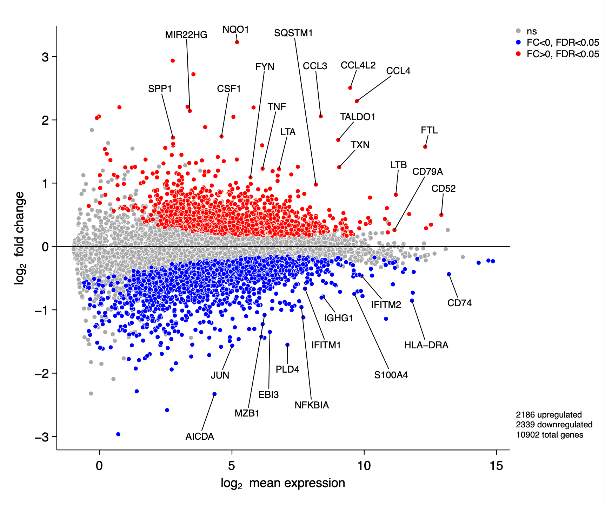
```

## Expanding full gene names

The `fullGeneNames` argument will use Bioconductor package `AnnotationDbi` and
the `org.Hs.eg.db` human gene database to expand gene symbols in the Table tab.
Both will need to be installed from Bioconductor.

```{r eval = FALSE}
BiocManager::install("AnnotationDbi")
BiocManager::install("org.Hs.eg.db")
easyVolcano(volc1, useQ = TRUE, fullGeneNames = TRUE)
```

```{r table1, echo = FALSE, message=FALSE, fig.align='center', out.width='100%', out.extra='style="border: 0;"'}
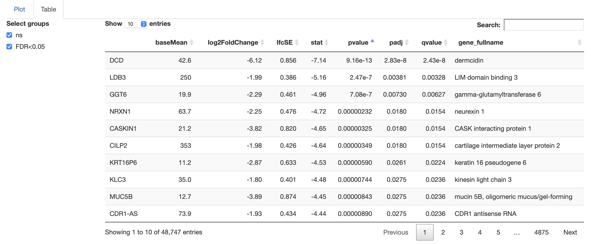
```

Full gene names are also shown when hovering over points in the scatter plot,
which can make it easier to label points of interest. For mouse genes, install 
`org.Mm.eg.db` and set `AnnotationDb = org.Mm.eg.db` (note the lack of quotes).

```{r eval = FALSE}
BiocManager::install("org.Mm.eg.db")
library(org.Mm.eg.db)
easyVolcano(volc1,
          fullGeneNames = TRUE,
          AnnotationDb = org.Mm.eg.db)
```

## Colour schemes

For volcano plots a simple colour scheme with downregulated genes in blue and
upregulated genes in red can be rendered by setting `fccut = 0`.

```{r eval = FALSE}
easyVolcano(volc2,
            useQ = TRUE,
            fccut = 0,
            main = "Volcano title")
```

```{r plot7, echo = FALSE, message=FALSE, fig.align='center', out.width='80%', out.extra='style="border: 0;"'}
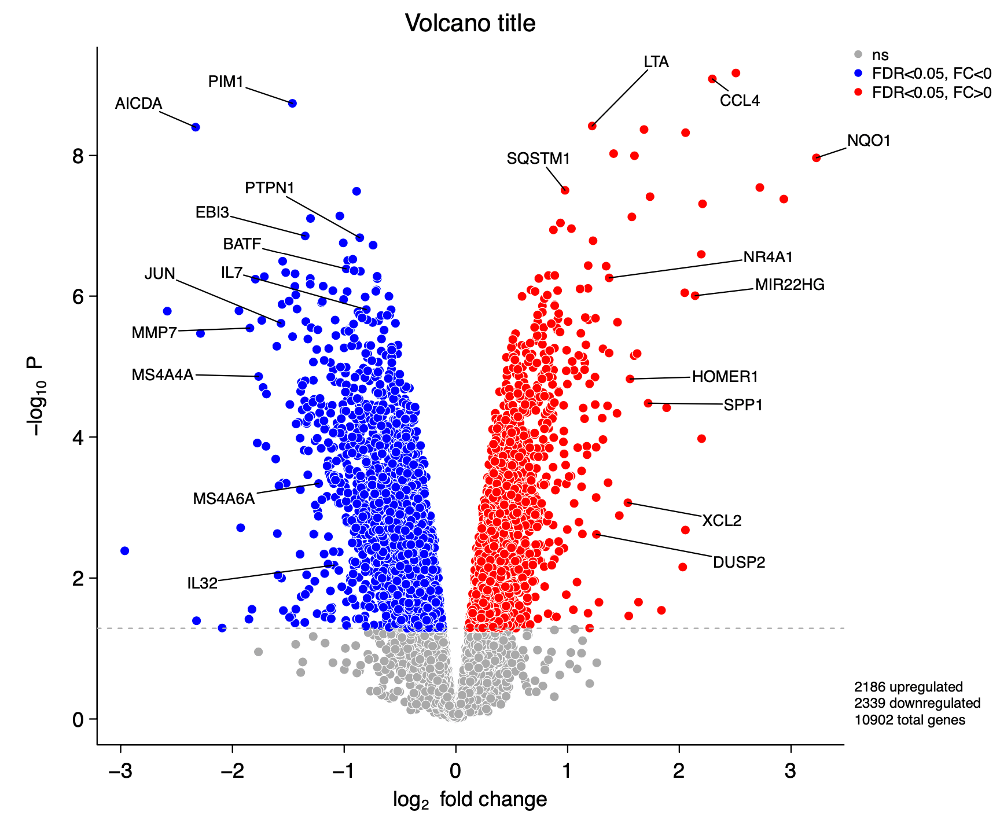
```

## Titles

A title can be added using `main = "Title"`. The font size of the title can be 
modified using `cex.main = 2` (default 1.2) if saving to PDF.

## Adding left/right subtitles

You can add left and right sided titles using `Ltitle` and `Rtitle` to explain
the direction of effect for up/downregulation. The use of `expression` in the
example below shows how to add left/right arrow symbols to the titles. The 
symbols only appear in the saved PDF - they are not compatible with plotly.

`LRtitle_side = 1` puts these titles on the bottom while `LRtitle_side = 3` puts
them on the top.

`cex.lab` controls font size for these titles as well as axis titles.
`cex.axis` controls font size for axis numbering.

```{r eval = FALSE}
easyVolcano(volc1,
            useQ = TRUE, fullGeneNames = TRUE,
            Ltitle = expression(symbol("\254") ~ "Non-responder"),
            Rtitle = expression("Responder" ~ symbol("\256")),
            LRtitle_side = 1,
            cex.lab = 0.9, cex.axis = 0.8,
            fccut = c(1, 2), fdrcutoff = 0.2,
            ylim = c(0, 6), xlim = c(-5, 5),
            colScheme = c('darkgrey', 'blue', 'orange', 'red'))
```

```{r plot3, echo = FALSE, message=FALSE, fig.align='center', out.width='80%', out.extra='style="border: 0;"'}
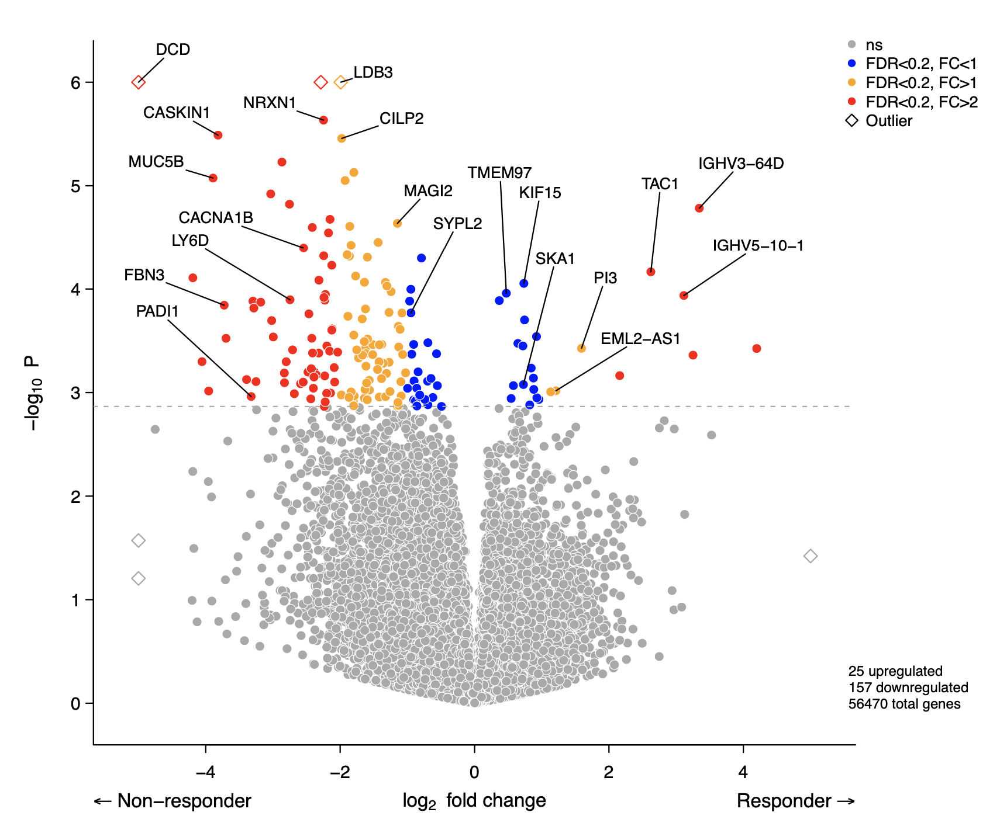
```

## Setting P value cut-off

The FDR cutoff is set using `fdrcutoff` (volcano plots allow a single value,
while MA plots allow multiple values). In order to force significant
genes to be shown based on unadjusted P values, this can be achieved by a
workaround setting both `y` and `padj` manually to the unadjusted p value
column. Note this does mean the legend incorrectly states 'FDR < ' etc.

```{r eval = FALSE}
easyVolcano(volc1, y = 'pvalue', padj = 'pvalue', fdrcutoff = 0.01)
```

## Axis limits and outliers

`xlim` and `ylim` allow control over the range of each axis. Outlying points are
shown as diamonds (see example above). Outliers can be toggled off using 
`showOutliers = FALSE`. Outlier symbol, colour and line width can be set using 
`outlier_shape`, `outlier_col` and `outlier_lwd` respectively.

## Complex colour schemes

The colour scheme system has been expanded to allow multiple fold change
cut-offs. In the example above the colours are symmetrical. 

In the next 2 plots, the colours range from blue for downregulated genes,
through to red for upregulated genes. Vertical lines can be added using `vline`.

```{r eval = FALSE}
colScheme <- c('darkgrey', 'blue', 'lightblue', 'orange', 'red')
easyVolcano(volc1, fccut = 1, fdrcutoff = 0.2,
            ylim = c(0, 6), xlim = c(-5, 5),
            colScheme = colScheme, 
            vline = c(-1, 1))
```

```{r plot4, echo = FALSE, message=FALSE, fig.align='center', out.width='80%', out.extra='style="border: 0;"'}
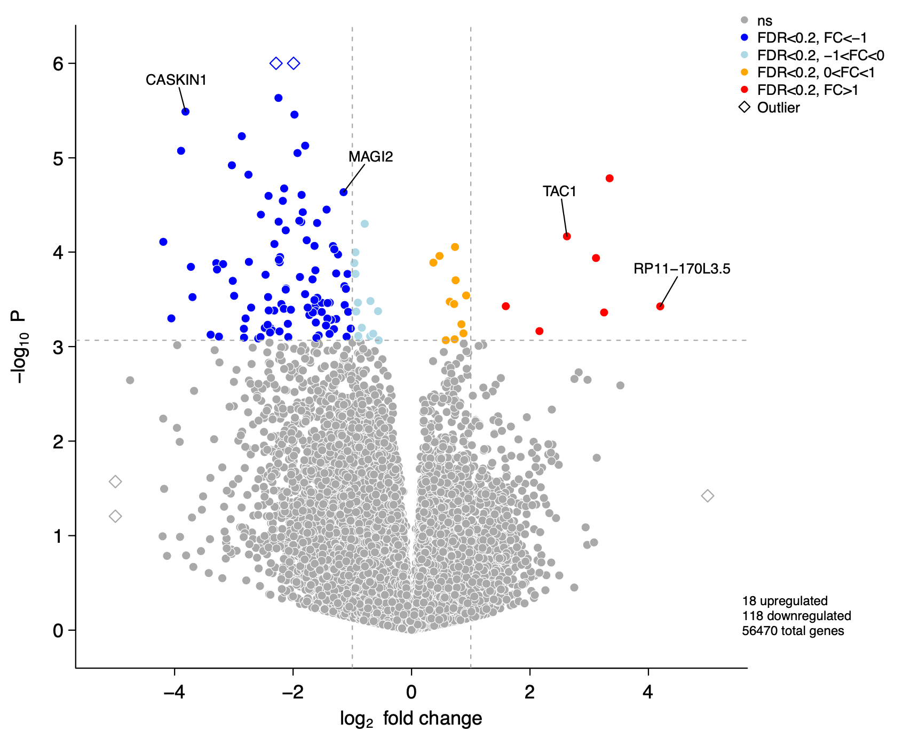
```

The next example has 6 colours and also shows how to remove the white outlines
around points using `outline_col = NA` and use transparency instead via `alpha`.
```{r eval = FALSE}
library(RColorBrewer)
colScheme <- c('darkgrey', brewer.pal(9, 'RdYlBu')[c(9:7, 3:1)])
easyVolcano(volc1, fccut = c(1, 2), fdrcutoff = 0.2, 
            ylim = c(0, 6), xlim = c(-5, 5),
            colScheme = colScheme, 
            alpha = 0.75, outline_col = NA)
```

```{r plot5, echo = FALSE, message=FALSE, fig.align='center', out.width='80%', out.extra='style="border: 0;"'}
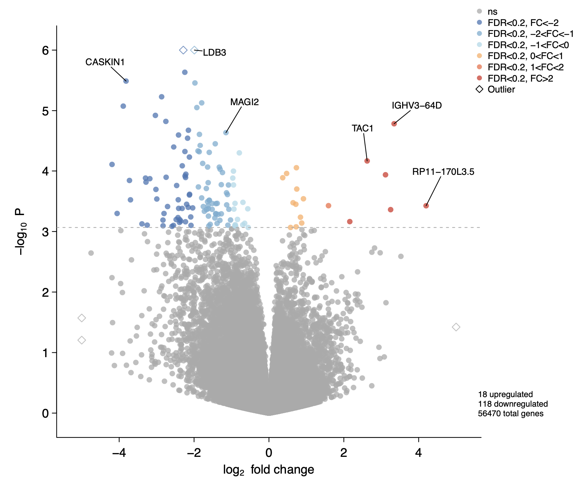
```

Similarly 6 colours can be applied to MA plots using 3 levels of cut-off for FDR
(note the colour scheme is in a slightly different order).

```{r eval = FALSE}
colScheme <- c('darkgrey', brewer.pal(9, 'RdYlBu')[c(7:9, 3:1)])
easyMAplot(volc2, fdrcutoff = c(0.05, 0.01, 0.001), size = 6, useQ = TRUE,
       alpha = 0.75, outline_col = NA,
       colScheme = colScheme)
```

```{r easyMAplot2, echo = FALSE, message=FALSE, fig.align='center', out.width='80%', out.extra='style="border: 0;"'}
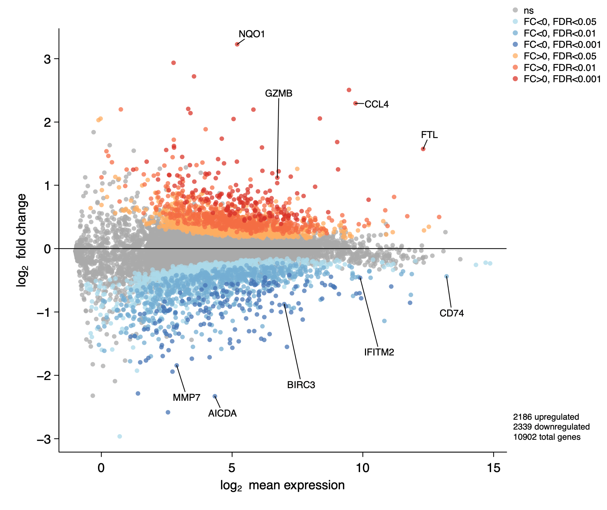
```

# Controlling labels

Label lines can be altered using the argument `labelDir` or by selecting the
Label direction pulldown menu in the shiny app. A couple of examples are shown 
below:

```{r eval = FALSE}
easyVolcano(volc1, labelDir = "horiz")
easyMAplot(volc1, labelDir = "vert")
```

```{r labdirs1, echo = FALSE, message=FALSE, fig.show='hold', out.width='48%', out.extra='style="border: 0;"'}
knitr::include_graphics(c("labdir_horiz.png", "labdir_vert.png"))
```

## Label line and text

Label line colour can be set using `line_col`. Label text colour can be set 
using `text_col`. Each of these can be set to match the colour of each point by 
setting each to `"match"`. Default label line length can be altered by changing 
`lineLength` (default 75 in pixels). `cex.text` can be changed to alter the 
font size of labels (default 0.72).

## Adding label boxes

Rectangles can be drawn around the label text, using `rectangles = TRUE`, and 
will appear when saving to PDF (they are not supported in plotly). Rectangle 
fill colour can be set using `rect_col` and rectangle border colour can be set 
using `border_col`. Use `border_col = NA` to turn off rectangle borders. The 
amount of padding in pixels around label text can be specified by setting 
`padding`. The amount of roundedness in pixels of rectangle corners is specified 
by `border_radius`.

```{r eval = FALSE}
# Simple outlines
easyVolcano(volc2, useQ = TRUE, fccut = 0,
            rectangles = TRUE)

# Red outlined labels, rounded ends
easyVolcano(volc2, useQ = TRUE, fullGeneNames = TRUE,
            rectangles = TRUE,
            padding = 5,
            border_radius = 10,
            line_col = 'red',
            border_col = 'red',
            text_col = 'red')
```

```{r labrect2, echo = FALSE, message=FALSE, fig.show='hold', out.width='80%', out.extra='style="border: 0;"'}
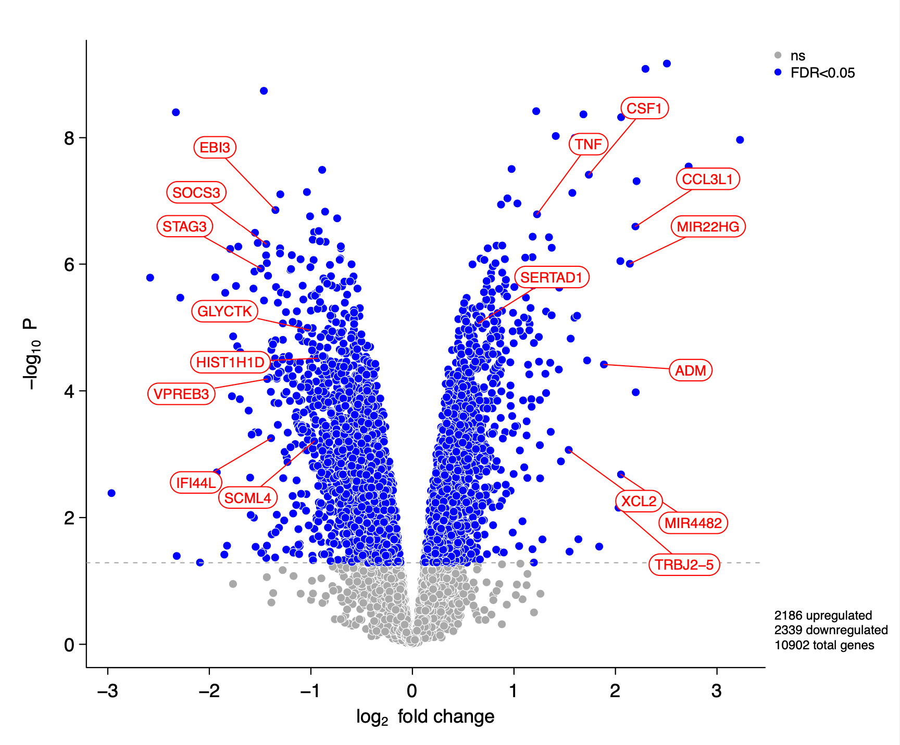
```

```{r eval = FALSE}
# Transparent grey rectangles, rounded ends
easyMAplot(volc2, fdrcut = c(0.05, 0.01, 0.001), size = 6, useQ = TRUE,
       alpha = 0.75, outline_col = NA,
       fullGeneNames = TRUE,
       colScheme = c('darkgrey', brewer.pal(9, 'RdYlBu')[c(7:9, 3:1)]),
       rectangles = TRUE,
       border_col = NA,
       padding = 5,
       rect_col = adjustcolor('grey', alpha.f = 0.6),
       border_radius = 20)

# White text on black background, no rounding
easyVolcano(volc2, useQ = TRUE, fullGeneNames = TRUE,
            fccut = 0,
            rectangles = TRUE,
            padding = 4,
            border_radius = 0,
            rect_col = 'black',
            text_col = 'white',
            border_col = NA)
```

```{r labrect4, echo = FALSE, message=FALSE, fig.show='hold', out.width='80%', out.extra='style="border: 0;"'}
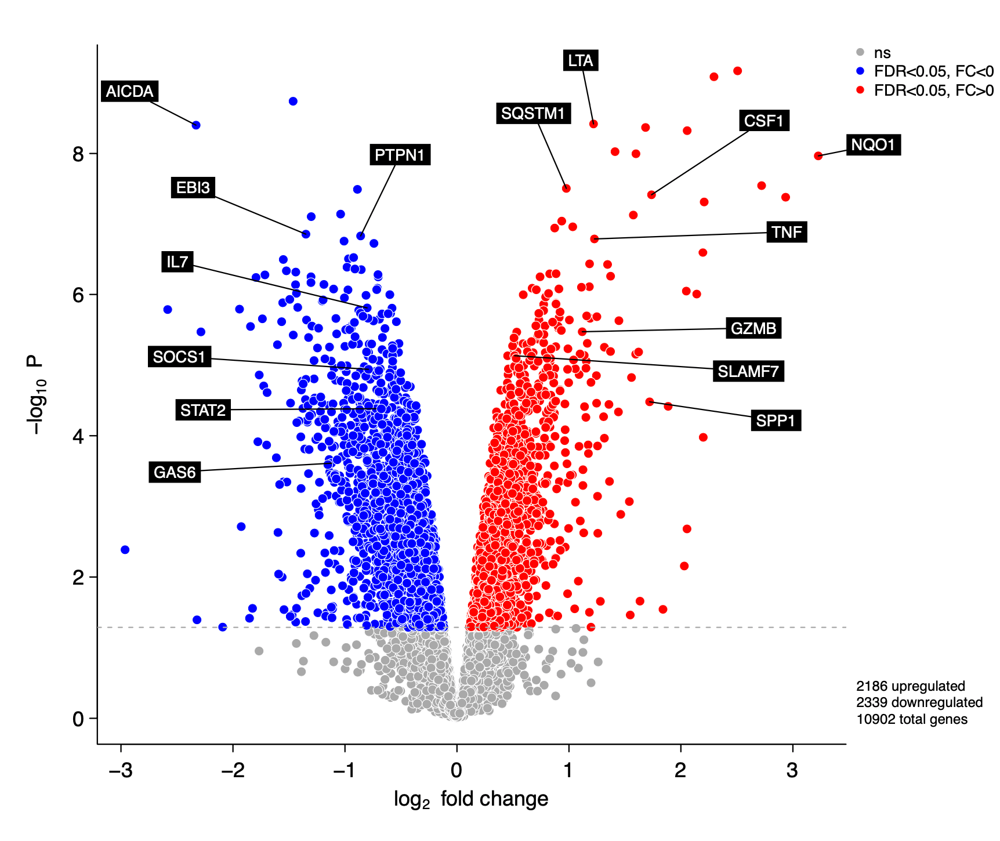
```

## Matching label & point colours

While label text and label lines can be adjusted by setting `text_col` and 
`line_col` to individual colours, label text and label lines can also be set to 
mirror the colour of each point by setting `text_col = "match"` and 
`line_col = "match"` respectively. Label box fill colour or rectangle outline 
colour can also be set to match each point's colour by setting 
`rect_col = "match"` or `border_col = "match"` (label boxes are not supported in 
plotly).

```{r eval = FALSE}
# Label text and label lines match point colours
easylabel(gapminder[gapminder$year == 2007, ], x = 'gdpPercap', y = 'lifeExp',
          col = 'continent', labs = 'country', 
          size = 'pop',
          alpha = 0.6,
          line_col = "match", text_col = "match",
          zeroline = FALSE, showgrid = "y")
```

```{r labmatch1, echo = FALSE, message=FALSE, fig.show='hold', out.width='80%', out.extra='style="border: 0;"'}
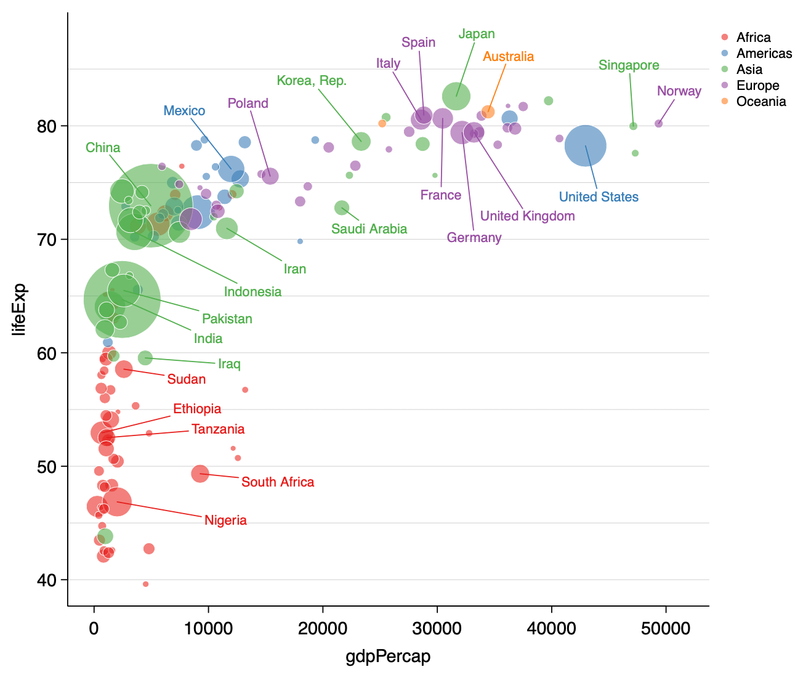
```

```{r eval = FALSE}
# Rectangle fill colour and label line match point colours, rounded rectangles
easylabel(gapminder[gapminder$year == 2007, ], x = 'gdpPercap', y = 'lifeExp',
          col = 'continent', labs = 'country', 
          size = 'pop',
          alpha = 0.6,
          line_col = "match", text_col = "white",
          rectangles = TRUE, border_col = NA,
          rect_col = "match", border_radius = 20, padding = 5,
          zeroline = FALSE, showgrid = "y")
```

```{r labmatch2, echo = FALSE, message=FALSE, fig.show='hold', out.width='80%', out.extra='style="border: 0;"'}
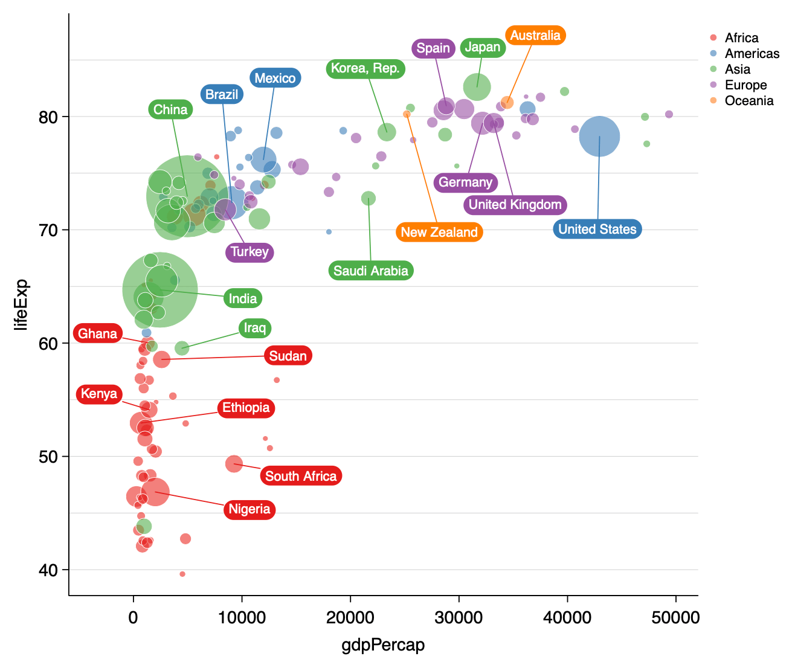
```

# Manhattan plot

Manhattan plots can be labelled using the function `easyManhattan()`. Plotly 
struggles with more than about 100,000 points, so we use a filtering system to 
reduce the number of points shown in the plotly interactive plot, while the full 
plot with all points is produced when saving to PDF. An example is shown below:

```{r eval = FALSE}
# Manhattan plot using SLE GWAS data from Bentham et al 2015
# FTP download full summary statistics from
# https://www.ebi.ac.uk/gwas/studies/GCST003156
library(data.table)
SLE_gwas <- fread('../bentham_2015_26502338_sle_efo0002690_1_gwas.sumstats.tsv')
# Simple Manhattan plot
easyManhattan(SLE_gwas)

# 4 colours for chromosomes
easyManhattan(SLE_gwas, chromCols = RColorBrewer::brewer.pal(4, 'Paired'))
```

```{r manhat, echo = FALSE, message=FALSE, fig.show='hold', out.width='80%', out.extra='style="border: 0;"'}
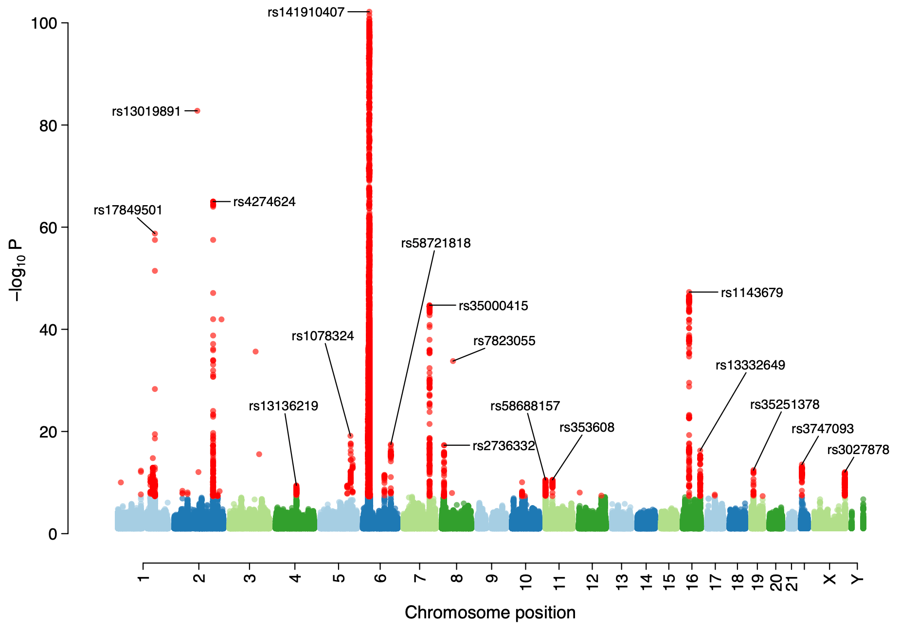
```

By default Manhattan plots display only the top 100,000 points by p value in 
the plotly window and plot the top 1 million SNPs when saving to PDF. These 
defaults can be altered by setting `npoints` and `nplotly`. Setting `npoints` 
to `NA` will plot all points when saving to PDF.

```{r eval = FALSE}
# Examples
# 12 colours for chromosomes, no separate colour for significant points
easyManhattan(SLE_gwas, chromCols = RColorBrewer::brewer.pal(12, 'Paired'), 
              sigCol = NA)

# Label peaks automatically, add horizontal gridlines
easyManhattan(SLE_gwas, npeaks = 20, showgrid = "y")

# Vertical version
easyManhattan(SLE_gwas, transpose = TRUE, height = 1000, width = 600)

# Chr1 only
easyManhattan(SLE_gwas[SLE_gwas$chrom == 1, ])

# Add symbols for the significant SNPs
easyManhattan(SLE_gwas, chromCols = RColorBrewer::brewer.pal(4, 'Paired'),
              size = 8,
              shape = 'col',
              shapeScheme = c(rep(20, 4), 18))
```

# Known issues

* Plotly's `scattergl` function, which uses webGL, seems to have a limit of 
  around 400,000 scatter points per plot. Above this level, the shiny/plotly 
  app becomes sluggish or freezes and becomes unusable. We recommend limiting 
  plots to around 100,000 points using the `plotly_filter` argument. See 
  [plotly_filter].
