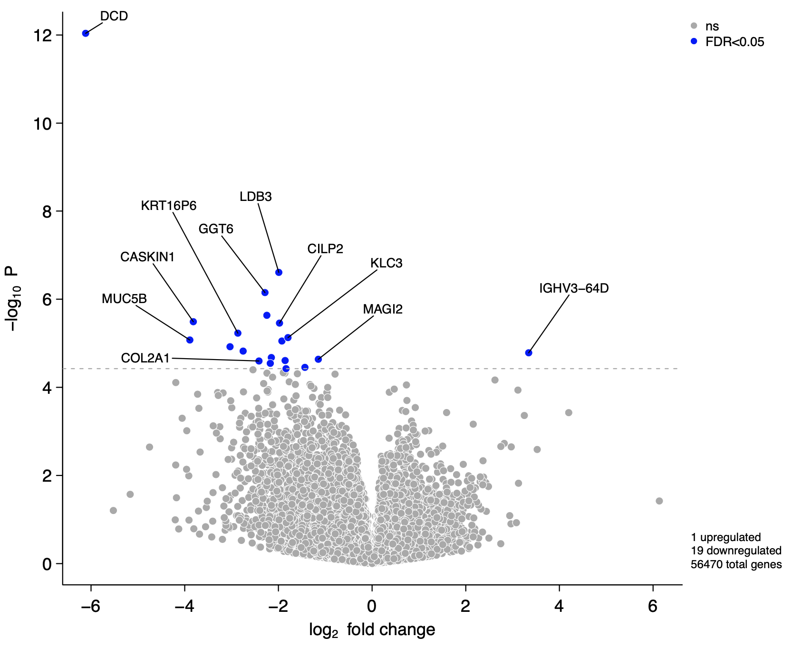
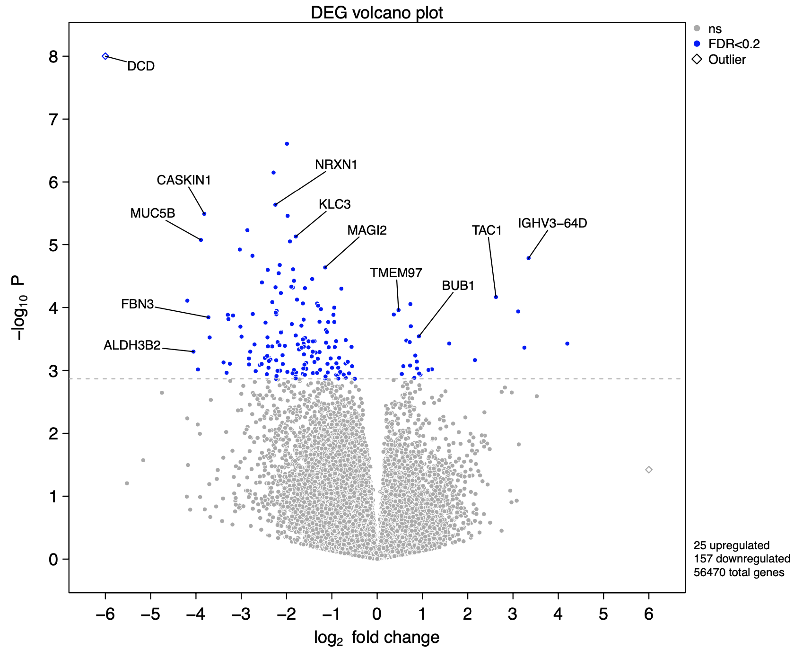
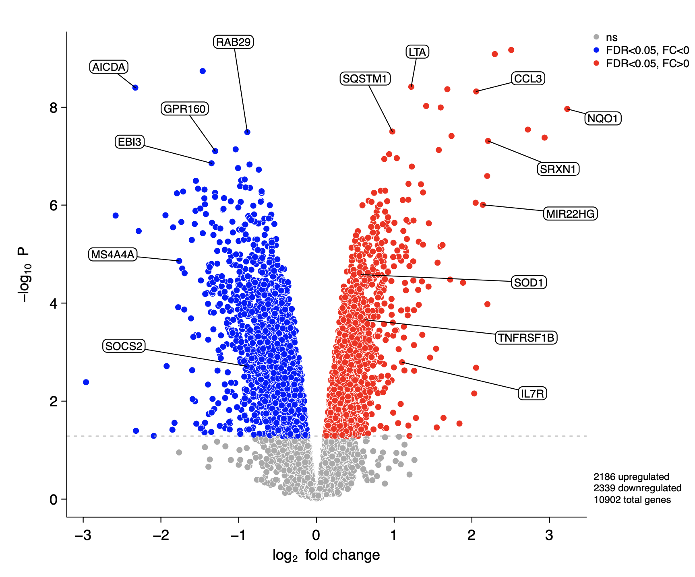
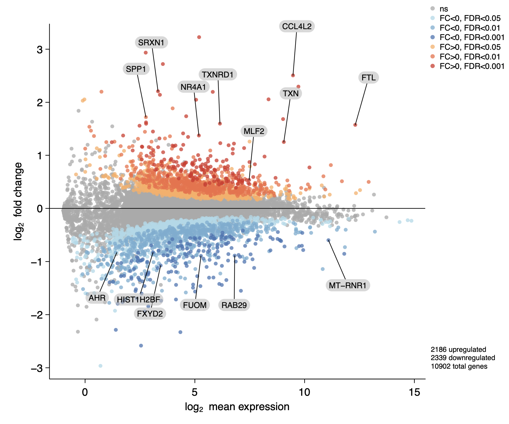

# Introduction

A common problem in R is labelling scatter plots with large numbers of points
and/or labels. We provide a utility for easy labelling of scatter plots and 
quick plotting of volcano plots and MA plots for gene expression analyses. Using
an interactive shiny and plotly interface, users can hover over points to see
where specific points are located and click on points to easily label them. 
Labels can be toggled on/off simply by clicking. An input box and batch input 
window provides an easy way to label points by name. Labels can be dragged 
around the plot to place them optimally.

```{r, include = FALSE}
knitr::opts_chunk$set(
  collapse = TRUE,
  comment = "#>"
)
```

```{r setup, include = FALSE}
library(easylabel)
```

# Installation

Install from Github
```{r eval = FALSE}
devtools::install_github("myles-lewis/easylabel", auth_token="...")
library(easylabel)
```

# Simple instructions
* Hover over and click on/off genes which you want to label.
* When you have selected all your chosen genes, then drag gene names to move
  label positions.
* Click the save button to export a PDF in base graphics.

## To export an SVG from plotly
* You can move the legend as well.
* Switch to SVG when finalised (only do this at last moment as otherwise
  editing is very slow).
* Press camera button in the plotly modebar to save image as SVG.

# Examples

## Scatter plots

Use `easylabel` to open a shiny app and plot and label scatter plots. A table of 
the main data is supplied in the Table tab for easy viewing of data.

```{r include = FALSE}
ymatrix <- readRDS('/Users/myles/R/R4RA/ymatrix_drug_time.rds')
```
```{r eval = FALSE}
easylabel(ymatrix, x = 'x', y = 'y', col = 'col',
          scheme = c('darkgrey', 'green3', 'gold3', 'blue'),
          xlab = expression("log"[2] ~ " fold change post-Rituximab"),
          ylab = expression("log"[2] ~ " fold change post-Tocilizumab"),
          showgrid = TRUE)
```

```{r plot1, echo = FALSE, message=FALSE, fig.align='center', out.width='90%', out.extra='style="border: 0;"'}
knitr::include_graphics("plot1.png")
```

# Volcano plots

Use the `easyVolcano()` function to quickly plot a volcano plot from DESeq2 or
EdgeR objects. The `useQ` argument will switch to using q values for FDR.

```{r include = FALSE}
volc1 <- readRDS('/Users/myles/R/R4RA/DESeq2.nociceptive.res.RDS')
```
```{r eval = FALSE}
easyVolcano(volc1, useQ = TRUE)
```

```{r plot2, echo = FALSE, message=FALSE, fig.align='center', out.width='90%', out.extra='style="border: 0;"'}

```

## MA plots

Use the `easyMAplot()` function to quickly plot an MA plot from DESeq2 or EdgeR
objects.

```{r include = FALSE}
volc2 <- readRDS('/Users/myles/R/R4RA/limma.output.RDS')
```
```{r eval = FALSE}
easyMAplot(volc2, useQ = TRUE)
```

```{r easyMAplot1, echo = FALSE, message=FALSE, fig.align='center', out.width='90%', out.extra='style="border: 0;"'}
knitr::include_graphics("MAplot1.png")
```

## Expanding full gene names

The `fullGeneNames` argument will use Bioconductor package `AnnotationDbi` and
the `org.Hs.eg.db` human gene database to expand gene symbols in the Table tab.
Both will need to be installed from Bioconductor.

```{r eval = FALSE}
BiocManager::install("AnnotationDbi")
BiocManager::install("org.Hs.eg.db")
easyVolcano(volc1, useQ = TRUE, fullGeneNames = TRUE)
```

```{r table1, echo = FALSE, message=FALSE, fig.align='center', out.width='100%', out.extra='style="border: 0;"'}
knitr::include_graphics("table1.png")
```

## Colour schemes

For volcano plots a simple colour scheme with downregulated genes in blue and
upregulated genes in red can be rendered by setting `fccut = 0`.

```{r eval = FALSE}
easyVolcano(volc2,
            useQ = TRUE,
            fccut = 0,
            main = "Volcano title")
```

```{r plot7, echo = FALSE, message=FALSE, fig.align='center', out.width='90%', out.extra='style="border: 0;"'}
knitr::include_graphics("plot7.png")
```

## Titles

A title can be added using `main = "Title"`.

## Adding left/right subtitles

You can add left and right sided titles using `Ltitle` and `Rtitle` to explain
the direction of effect for up/downregulation. The use of `expression` in the
example below shows how to add left/right arrow symbols to the titles. The 
symbols only appear in the saved pdf - they are not compatible with plotly.

`LRtitle_side = 1` puts these titles on the bottom while `LRtitle_side = 3` puts
them on the top.

`cex.lab` controls font size for these titles as well as axis titles.
`cex.axis` controls font size for axis numbering.


```{r eval = FALSE}
easyVolcano(volc1,
            useQ = TRUE, fullGeneNames = TRUE,
            Ltitle = expression(symbol("\254") ~ "Non-responder"),
            Rtitle = expression("Responder" ~ symbol("\256")),
            LRtitle_side = 1,
            cex.lab = 0.9, cex.axis = 0.8,
            fccut = c(1, 2), fdrcutoff = 0.2,
            ylim = c(0, 6), xlim = c(-5, 5),
            scheme = c('darkgrey', 'blue', 'orange', 'red'))
```

```{r plot3, echo = FALSE, message=FALSE, fig.align='center', out.width='90%', out.extra='style="border: 0;"'}
knitr::include_graphics("plot3.png")
```

## Complex colour schemes

The colour scheme system has been expanded to allow multiple fold change
cut-offs. In the example above the colours are symmetrical. 

## Axis limits and outliers

`xlim` and `ylim` allow control over the range of each axis. Outlying points are
shown as diamonds. See example above. Outliers can be toggled off using 
`showOutliers = FALSE`.

## Setting P value cut-off

The FDR cutoff is set using `fdrcutoff` (volcano plots allow a single value,
while MA plots allow multiple values). In order to force significant
genes to be shown based on unadjusted P values, this can be achieved by a
workaround setting both `y` and `padj` manually to the unadjusted p value
column. Note this does mean the legend incorrectly states 'FDR < ' etc.

```{r eval = FALSE}
easyVolcano(volc1, y = 'pvalue', padj = 'pvalue', fdrcutoff = 0.01)
```

In the next 2 plots, the colours range from blue for downregulated genes,
through to red for upregulated genes. Vertical lines can be added using `vline`.

```{r eval = FALSE}
scheme <- c('darkgrey', 'blue', 'lightblue', 'orange', 'red')
easyVolcano(volc1, fccut = 1, fdrcutoff = 0.2,
            ylim = c(0, 6), xlim = c(-5, 5),
            scheme = scheme, 
            vline = c(-1, 1))
```

```{r plot4, echo = FALSE, message=FALSE, fig.align='center', out.width='90%', out.extra='style="border: 0;"'}
knitr::include_graphics("plot4.png")
```

The next example has 6 colours and also shows how to remove the white outlines
around points using `outline_col = NA` and use transparency instead via `alpha`.
```{r eval = FALSE}
library(RColorBrewer)
scheme <- c('darkgrey', brewer.pal(9, 'RdYlBu')[c(9:7, 3:1)])
easyVolcano(volc1, fccut = c(1, 2), fdrcutoff = 0.2, 
            ylim = c(0, 6), xlim = c(-5, 5),
            scheme = scheme, 
            alpha = 0.75, outline_col = NA)
```

```{r plot5, echo = FALSE, message=FALSE, fig.align='center', out.width='90%', out.extra='style="border: 0;"'}
knitr::include_graphics("plot5.png")
```

Similarly 6 colours can be applied to MA plots using 3 levels of cut-off for FDR
(note the colour scheme is in a slightly different order).

```{r eval = FALSE}
scheme <- c('darkgrey', brewer.pal(9, 'RdYlBu')[c(7:9, 3:1)])
easyMAplot(volc2, fdrcutoff = c(0.05, 0.01, 0.001), cex = 0.8, useQ = TRUE,
       alpha = 0.75, outline_col = NA,
       scheme = scheme)
```

```{r easyMAplot2, echo = FALSE, message=FALSE, fig.align='center', out.width='90%', out.extra='style="border: 0;"'}
knitr::include_graphics("MAplot2.png")
```

## Further control of plotting

The size of markers can be changed using `cex` (default 1).
A box around the plot can be added using `bty='o'` (see `par()`).
Axes can be customised by first suppressing the initial axis using `xaxt='n'` or
`yaxt='n'` and then adding an `axis()` call using `panel.last`.
A top title can also be added using `main`.

```{r eval = FALSE}
easyVolcano(volc1, useQ = TRUE, fdrcutoff = 0.2, ylim = c(0,8), xlim = c(-6,6),
            cex = 0.6,
            xaxt = 'n', yaxt = 'n', bty = 'o',
            main = "DEG volcano plot",
            panel.last = {
              axis(side = 1, at = -6:6)
              axis(side = 2, at = 0:8)
            })
```

```{r plot6, echo = FALSE, message=FALSE, fig.align='center', out.width='90%', out.extra='style="border: 0;"'}

```

## Controlling labels

Label lines can be altered using the argument `labelDir` or by selecting the
Label direction pulldown menu in the shiny app. Options are shown below:

```{r eval = FALSE}
easyVolcano(volc1, labelDir = "radial")
easyVolcano(volc1, labelDir = "origin")
```

```{r labdirs1, echo = FALSE, message=FALSE, fig.show='hold', out.width='48%', out.extra='style="border: 0;"'}
knitr::include_graphics(c("labdir radial.png", "labdir origin.png"))
```

```{r eval = FALSE}
easyVolcano(volc1, labelDir = "horiz")
easyMAplot(volc1, labelDir = "vert")
```

```{r labdirs2, echo = FALSE, message=FALSE, fig.show='hold', out.width='48%', out.extra='style="border: 0;"'}
knitr::include_graphics(c("labdir horiz.png","labdir vert.png"))
```

```{r eval = FALSE}
easyVolcano(volc1, labelDir = "xellipse")
easyMAplot(volc1, labelDir = "yellipse")
```

```{r labdirs3, echo = FALSE, message=FALSE, fig.show='hold', out.width='48%', out.extra='style="border: 0;"'}
knitr::include_graphics(c("labdir xellipse.png", "labdir yellipse.png"))
```

```{r eval = FALSE}
easyVolcano(volc1, labelDir = "rect")
easyVolcano(volc1, labelDir = "oct")
```

```{r labdirs4, echo = FALSE, message=FALSE, fig.show='hold', out.width='48%', out.extra='style="border: 0;"'}
knitr::include_graphics(c("labdir rect.png", "labdir oct.png"))
```

## Adding label boxes

Rectangles can be drawn around the label text, using `rectangles = TRUE`.

```{r eval = FALSE}
# Simple outlines
easyVolcano(volc2, useQ = TRUE, fccut = 0,
            rectangles = TRUE)
```

```{r labrect1, echo = FALSE, message=FALSE, fig.show='hold', out.width='80%', out.extra='style="border: 0;"'}

```

```{r eval = FALSE}
# Red outlined labels, rounded ends
easyVolcano(volc2, useQ = TRUE, fullGeneNames = TRUE,
            rectangles = TRUE,
            padding = 5,
            border_radius = 10,
            line_col = 'red',
            border_col = 'red',
            text_col = 'red')
```

```{r labrect2, echo = FALSE, message=FALSE, fig.show='hold', out.width='80%', out.extra='style="border: 0;"'}
knitr::include_graphics("rect red outline.png")
```

```{r eval = FALSE}
# Transparent grey rectangles, rounded ends
easyMAplot(volc2, fdrcut = c(0.05, 0.01, 0.001), cex = 0.8, useQ = TRUE,
       alpha = 0.75, outline_col = NA,
       fullGeneNames = TRUE,
       scheme = c('darkgrey', brewer.pal(9, 'RdYlBu')[c(7:9, 3:1)]),
       rectangles = TRUE,
       border_col = NA,
       padding = 5,
       rect_col = adjustcolor('grey', alpha.f = 0.6),
       border_radius = 20)
```

```{r labrect3, echo = FALSE, message=FALSE, fig.show='hold', out.width='80%', out.extra='style="border: 0;"'}

```

```{r eval = FALSE}
# White text on black background, no rounding
easyVolcano(volc2, useQ = TRUE, fullGeneNames = TRUE,
            fccut = 0,
            rectangles = TRUE,
            padding = 4,
            border_radius = 0,
            rect_col = 'black',
            text_col = 'white',
            border_col = NA)
```

```{r labrect4, echo = FALSE, message=FALSE, fig.show='hold', out.width='80%', out.extra='style="border: 0;"'}
knitr::include_graphics("rect invert.png")
```


# Known issues

* Currently `easylabel()` relies on plotly for the interactive scatter plot
  and uses webGL for speed as a plotly scattergl trace. A known bug exists in 
  the current version 4.9.4.1 of plotly for R which is still using plotly.js 
  version 2.0. This older version of plotly.js has a problem with poor 
  pixellation of scatter plots, particularly on highDPI (retina) displays. This 
  issue has been fixed in plotly.js version 2.5 and plotly/r version 4.9.4.9,
  which can be installed via Github:
  
```{r eval = FALSE}
remotes::install_github("ropensci/plotly")
```

  
